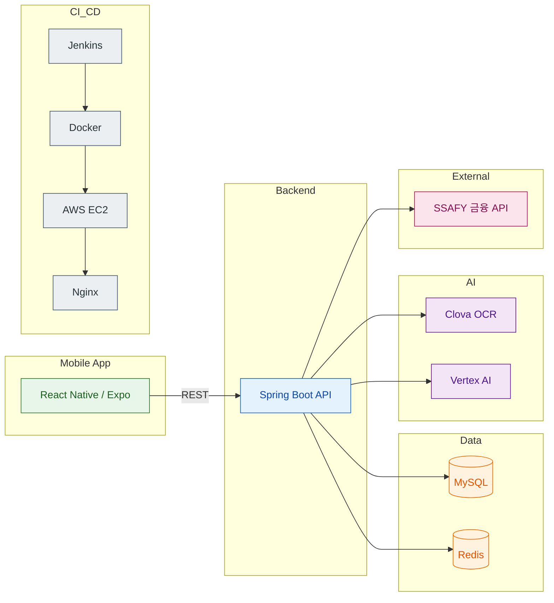
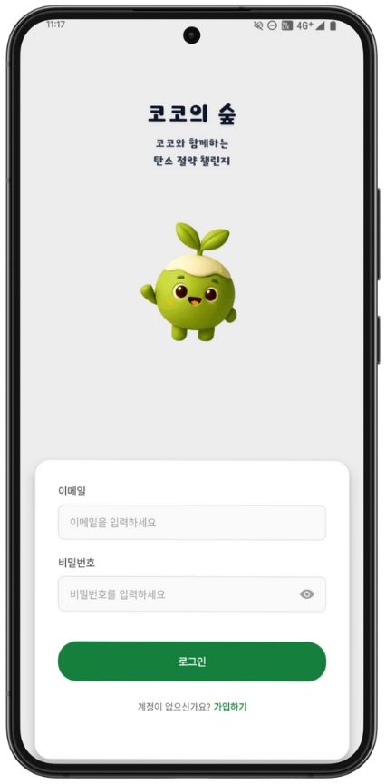
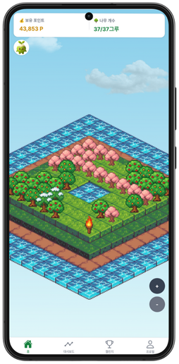
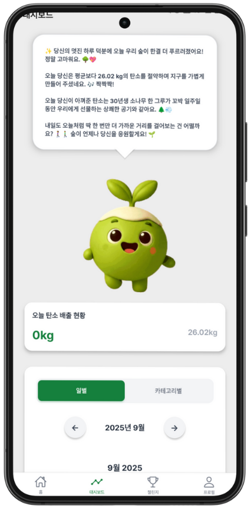
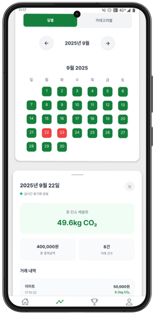
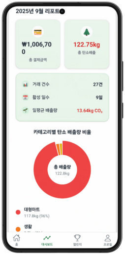
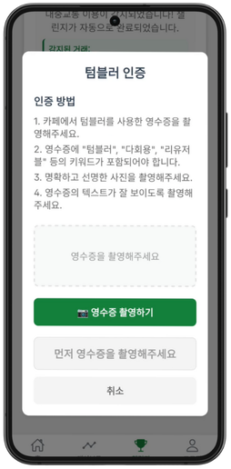
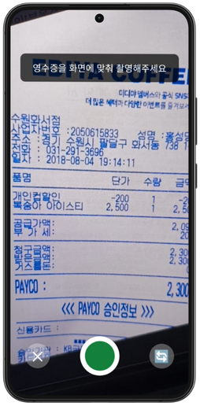
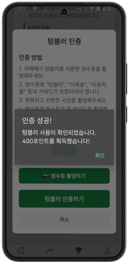

# 🌴 코코의 숲

## 목차
- [프로젝트 소개](#프로젝트-소개)
- [기술 스택](#기술-스택)
- [주요 기능](#주요-기능)
- [시스템 아키텍처](#시스템-아키텍처)
- [실행 방법](#실행-방법)
- [서비스 화면](#서비스-화면)
- [개발 팀 소개](#개발-팀-소개)

## 프로젝트 소개

> **코코의 숲**은 금융 소비 내역을 기반으로 탄소 배출량을 환산하고, 챌린지와 게임 요소를 통해 환경 보호를 즐겁게 실천하도록 돕는 서비스입니다.
>
> 소비 내역 → 탄소 배출량 → 챌린지 → 포인트 → 숲 성장으로 이어지는 구조를 통해, 사용자가 자연스럽게 친환경 습관을 형성할 수 있도록 설계했습니다.
>

- **개발 기간** : 2025.09.2 ~ 2025.10.2
- **플랫폼** : Android (React Native/Expo)
- **개발 인원** : 6명

## 기술 스택

#### Frontend
<div align="center">
  
  
  
  
</div>

#### Backend
<div align="center">
  
  
  
</div>

#### DevOps & Infra
<div align="center">
  
  
  
  
  
</div>

#### Database
<div align="center">
  
  
</div>


---

## 주요 기능

| 구분 | 구현 내용 |
| --- | --- |
| 홈(숲 화면) | 2D 아이소메트릭 숲 뷰, 나무 심기/물주기, 나무 상태(HP) 표시, 말풍선 안내 |
| 금융 연동 | SSAFY 금융 API 연동, 계좌/카드 거래 내역 조회, 소비 내역 기반 탄소 배출량 환산 |
| 대시보드 | 일/월별 리포트, 달력 기반 일자 선택, 카테고리별 배출량 차트, 상세 거래 내역 카드 |
| 챌린지 | 출석/대중교통/텀블러 챌린지, 텀블러 영수증 OCR 인증, 보상 포인트 지급 |

---

## 시스템 아키텍처



## 실행 방법

#### Frontend (React Native / Expo)
```bash
cd frontend/cocosforest
npm install
npm run start
```

#### Backend (Spring Boot)
```bash
cd backend
./gradlew bootRun
```

## 서비스 화면

- 로그인 화면 및 메인화면 

 

- 대시보드 화면 

  

- 챌린지 화면 (텀블러 영수증 인증) 

   

## 개발 팀 소개

| 이름 | 역할 |
| --- | --- |
| 김태윤 (팀장) | 백엔드, DB 설계, 금융 API 연동 |
| 권인 | 프론트엔드, 대시보드 API 연동 및 UI 구현, OCR API 연동 및 이미지 전처리 로직 설계, Expo 안드로이드 앱 빌드 |
| 김민주 | 프론트엔드, 사용자인증 로직 및 페이지 구현 |
| 정원준 | 백엔드 및 프론트엔드, 챌린지/보상 API 및 메인화면 구현 |
| 박민수 | 인프라, CI/CD, 배포 관리 |
| 박진주 | 프론트엔드, 챌린지/보상 API 연동 및 코코/숲 아트 에셋 제작 |

---
